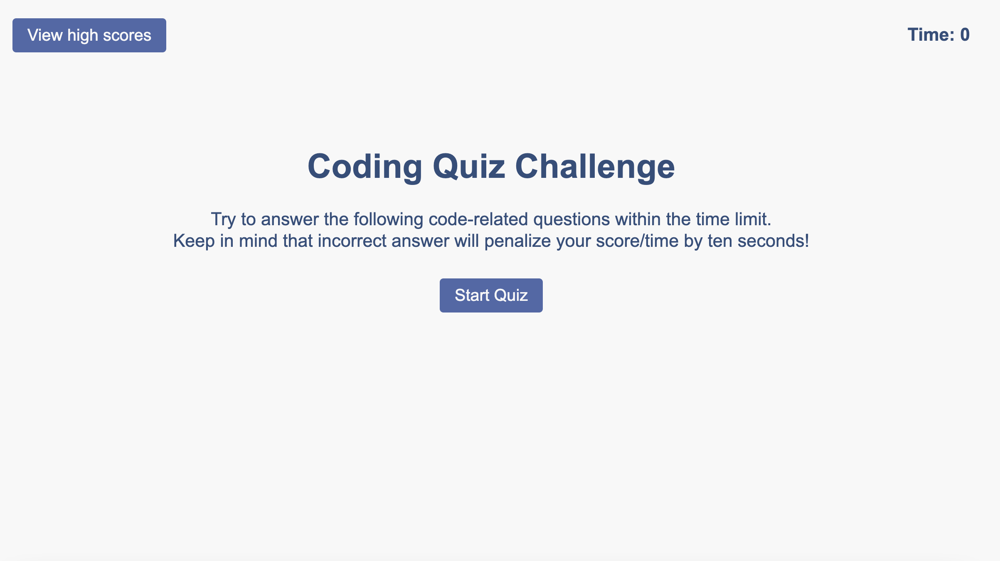
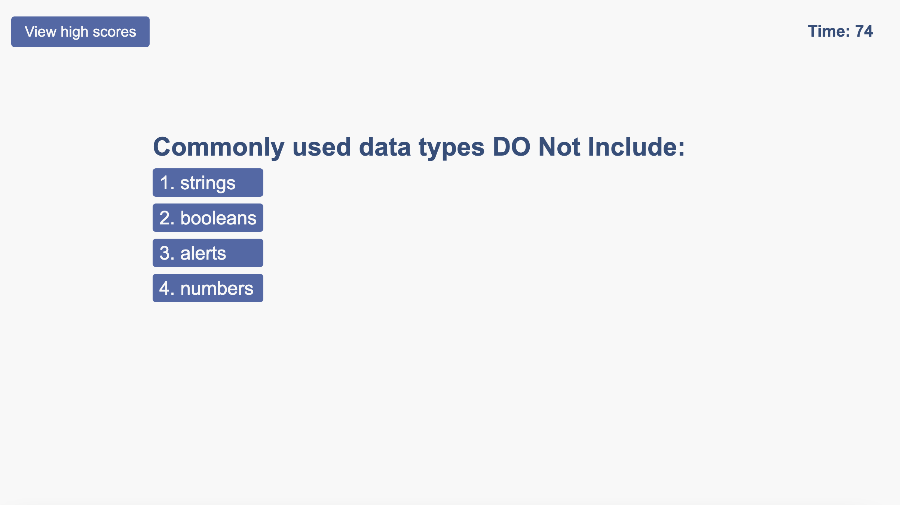
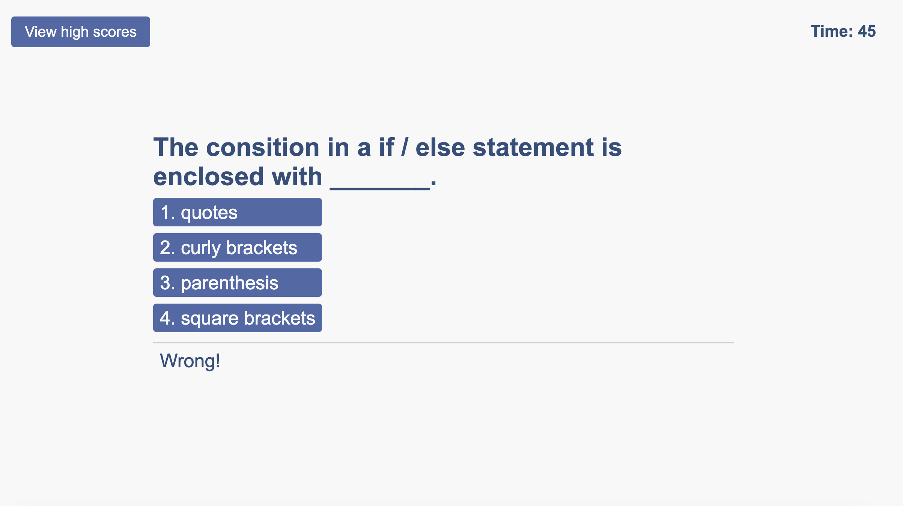
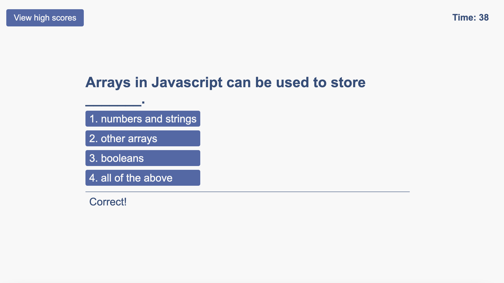
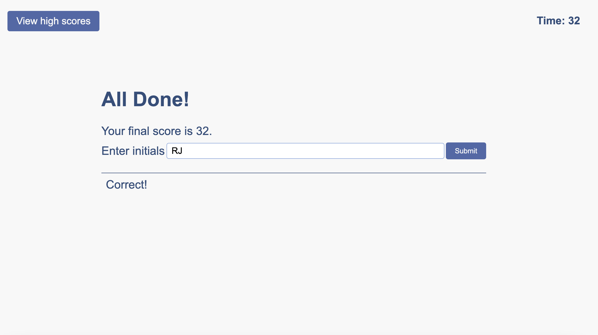
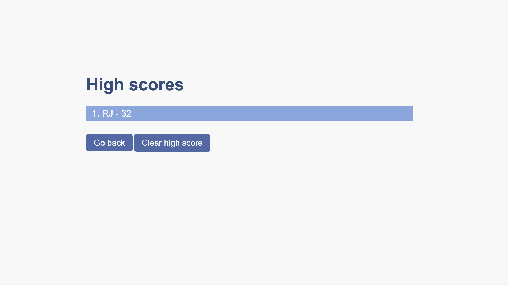

# Web APIs Timed Code Quiz

## Description

This is a timed quiz that tests your knowledge of JavaScript fundamentals.
On start, you will have 75 seconds and every wrong answer will penalize you by 10 seconds.
On finish, you will be given the time left as a score.
Once you input your initials, your score will be saved to a local storage as a high score and you will be redirected to the high score page.

## Table of Contents

- [Web APIs Timed Code Quiz](#web-apis-timed-code-quiz)
  - [Description](#description)
  - [Table of Contents](#table-of-contents)
  - [Technologies and Tools](#technologies-and-tools)
  - [Mock-Up](#mock-up)
  - [Screenshots](#screenshots)
  - [Installation](#installation)
  - [Development](#development)
  - [Questions](#questions)

## Technologies and Tools   
- [HTML5](https://developer.mozilla.org/en-US/docs/Web/Guide/HTML/HTML5)
- [CSS3](https://developer.mozilla.org/en-US/docs/Web/CSS/CSS3)
- [JavaScript](https://developer.mozilla.org/en-US/docs/Web/JavaScript)

## Mock-Up

## Screenshots

## Installation

No installation required.

## Development

Deployed application: [Live URL](https://jimenezraul.github.io/web-apis-timed-quiz/)

## Questions

If you have any questions, please feel free to contact me at [jimenezraul1981@gmail.com](mailto:jimenezraul1981@gmail.com)
